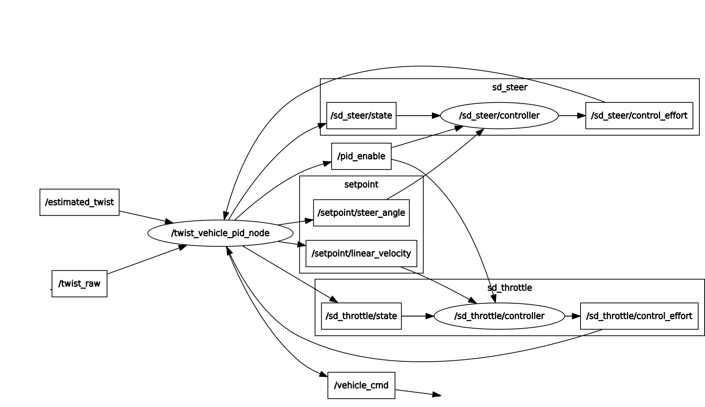

# twist_vehicle_pid
**1.0 Overview**  
In the feedback motion control, the twist message is transformed to the vehicle command (throttle and steering torque) via a PID controller. This node acts as a bridge between PID and DBW interface.   

This node converts and passes the target twist velocity (**/estimated_twist, /twist_raw**) to the ROS PID nodes.   
This node receives the throttle and steering output (**sd_steer/control_effort, sd_throttle/control_effort**) from the PID nodes and groups them to the vehicle command for the CANBus DBW interface   
  
**2.0 Node**  
2.1 Subscribe topics  
twist_raw (geometry_msgs/TwistStamped)  
	Target linear and angular velocity from the path following node e.g. PurePursuit  

sd_throttle/control_effort (std_msgs/Float64)  
	Output throttle control effort from the PID node.  

sd_steer/control_effort (std_msgs/Float64)  
	Output steering control effort from the PID node.  

estimated_twist (geometry_msgs/TwistStamped)  
	Current linear and angular velocity e.g. NDT localisation.  

final_waypoints_reach (std_msgs/Bool)  
	Brake command topic e.g when the goal has been reach. 	

brake_emergency (std_msgs/Bool)  
	Brake command in case of emergency e.g. Ultrasonic or Lidar safety node to check near obstruction.  

2.2 Publish topics  
setpoint/linear_velocity (std_msgs/Float64)  
	Target linear velocity.  

setpoint/steer_angle (std_msgs/Float64)  
	Target angular velocity.  

vehicle_cmd (autoware_msgs/VehicleCmd)  
	Autoware vehicle throttle/steering command for the CANBus DBW interface node.  

sd_throttle/state (std_msgs/Float64)  
	Current linear velocity.  

sd_steer/state (std_msgs/Float64)  
	Current angular velocity.  

pid_enable (std_msgs/Bool)  
	Enable ROS PID .

2.3 Service called  
setBrake (std_msgs/Bool)  
	This node calls this service to set the brake ON/OFF using '-100' or 'given' throttle output.  
	This service is used to release the brake after e.g. Emergency brake/ Goal reach without restarting   
	Use cases: 	
	1- setBrake true activated a full brake on the DWB CANBus output (vehicle_cmd.accel_cmd.accel = -100)  
	2- setBrake false release the brake and allow the throttle to have any speed  
	

2.4 Parameters  
	throttle_max  
		Limited maximum throttle output for CANBus DWB interface.     
	steering_max  
		Limited maximum steering output for CANBus DWB interface.  
	linear_v_max  
		Limited maximum linear velocity input e.g. forward velocity.  
	linear_v_min  
		Limited minimum linear velocity input e.g. reverse velocity.
	linear_w_max
		Limited maximum angular velocity input e.g. CCW turn
	linear_w_min
		Limited minimum linear velocity input e.g. CW turn
	wheel_base **(NOT USED)**  
	steering_ratio **(NOT USED)**  
	max_lat_accel **(NOT USED)**  
	max_steer_angle **(NOT USED)**  

# twist_vehicle_mapper
// TODO

# twist_velocity_base
// TODO
